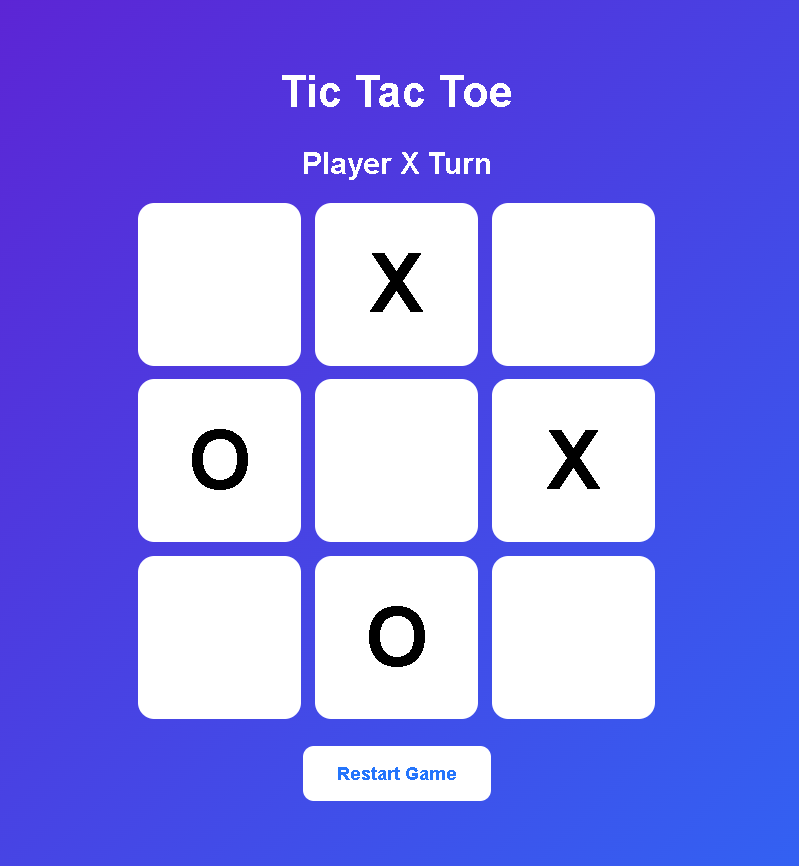

# Tic Tac Toe Game

A simple web-based Tic Tac Toe game built using HTML, CSS, and JavaScript.

## Features

- Two-player gameplay
- Win detection
- Draw detection
- Restart Game button
- Responsive design
- Modern gradient UI
- Winner and Draw popup screens

## Technologies Used

- HTML5
- CSS3
- JavaScript

## Live Demo

Play the game here:

https://yourusername.github.io/tic-tac-toe-game/

## How to Run Locally

1. Download or clone the repository.
2. Open `index.html` in a browser.

OR

Use VS Code with Live Server.

## Project Structure

```text
tic-tac-toe-game/
│
├── index.html
├── style.css
├── script.js
└── README.md
```

## Future Improvements

- Single-player mode (AI)
- Score tracking
- Sound effects
- Dark/Light themes
- Online multiplayer

## Screenshot



## Author

Omkar Nalawade
